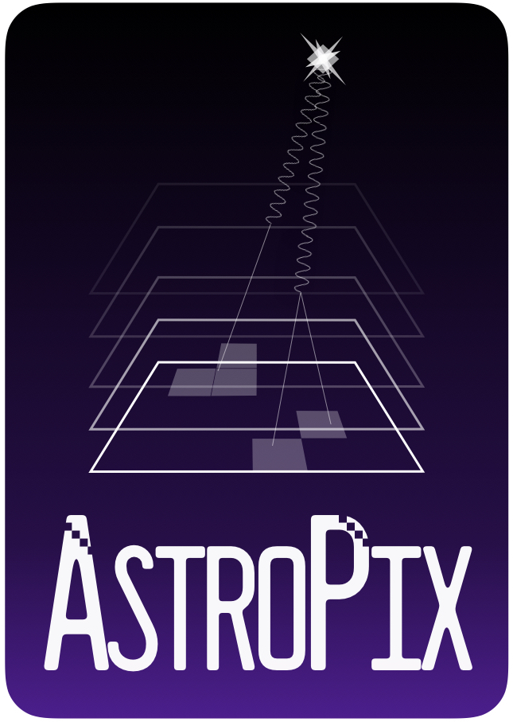

# ASTEP Firmware documentation

**Welcome to the ASTEP Firmware Readout repository**

{ align=left width="25%" }

You will find here sources for the Firmware targetting Gecco Nexys Video and CMOD boards, with different configurations based on the type of Astropix Carrier boards (Single Chip V2/V3/V4 , Telescope Chain, Multi-Layer etc..)

The Software part is a python library layer to ease working with the various firmware builds from one API, along with some readout and testing scripts. Experiment's main software sources may be hold in different repositories depending on Team's decision. 

## Important Releases / Change log

Important information: 

- Some Firmware Releases will be copied to the Google Drive: Hosted Payload/ReadoutPackage/firmware-releases
- Software has no planned packaging release for now, use this repository as a basis  
- There's no defined tagging strategy for now, the following change log will refer to a specific branch/commit ID as release pointer

### 2024/02/04: CMOD Reset Change 

- Commit ID: [7e6ca5fbe89bfd6ba2ecc723ac5f6bad2d86121c](https://github.com/AstroPix/astep-fw/commit/7e6ca5fbe89bfd6ba2ecc723ac5f6bad2d86121c){target=_blank}
- Firmware files: astropix-cmod_3_CONFIG_SE_24020201.{bit,bin,mcs} on Google Drive
- Changes:
    - Firmware: Added Internal Pull-up to cold_resn and warm_resn to ensure Firmware is active on boot. This can be changed in the future, or the reset can be pulled-down externally, for example on the Beagle Board interface cape.
    - Software: Started adding API interface to open connection to CMOD, still untested, expect some fixes needed