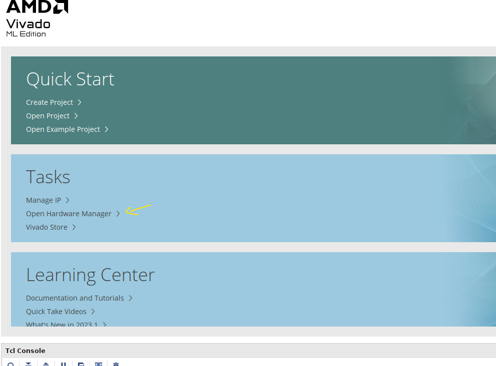
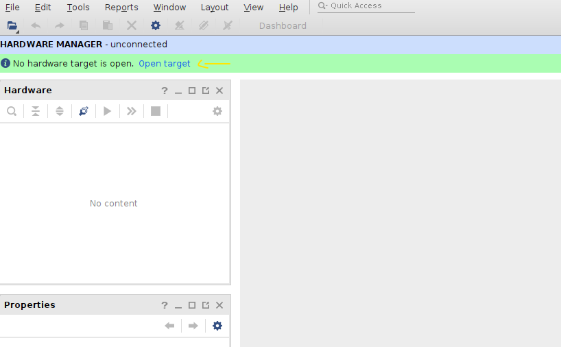
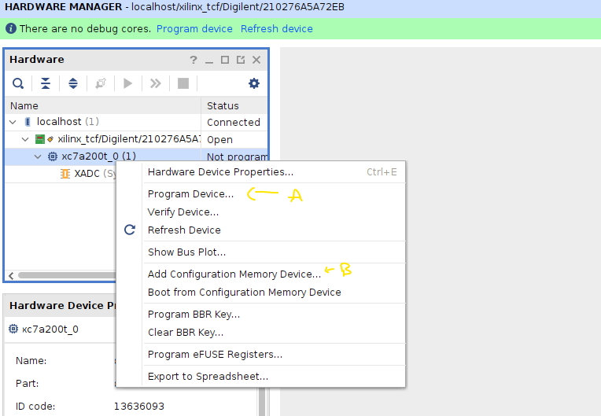
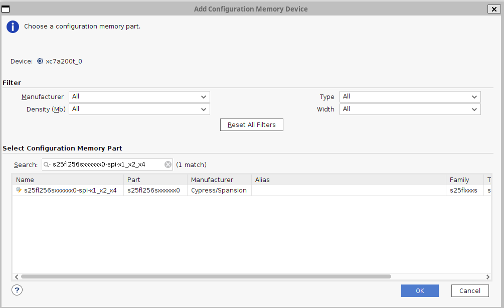
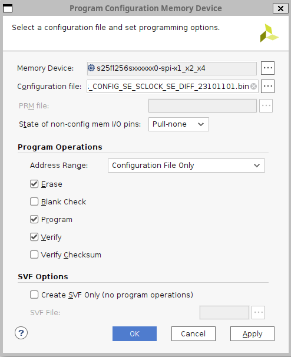

# FPGA Programming

To program your FPGA Board, build or download a pre-built firmware from a release location, then you can use the Vivado Hardware Manager to either:

- Simply flash the FPGA directly
- Program the FPGA Board embedded Flash, from which the FPGA will be configured after each power-up 

## Direct FPGA Programming 

Load and start vivado: 

Follow A to program directly, and B to program the flash device 

## SPI Flash: Nexys

The official guide is located here: <https://digilent.com/reference/learn/programmable-logic/tutorials/nexys-video-programming-guide/start>

The Flash Type is: 

s25fl256sxxxxxx0-spi-x1_x2_x4

Configure the next Window as presented below, click OK then wait for the Flash Memory to be programmed (it can take a while)

